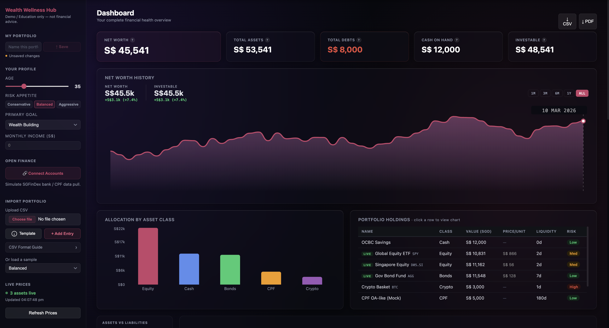
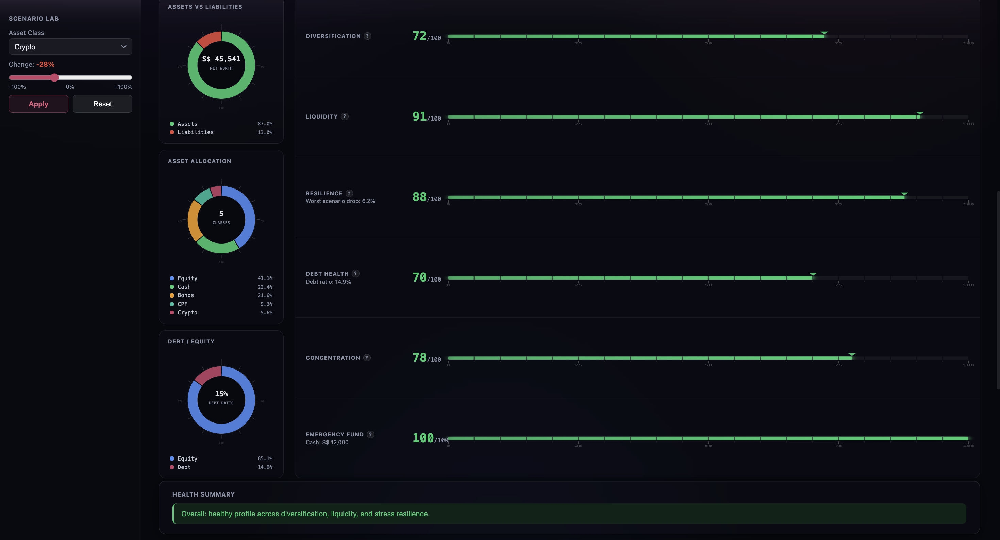
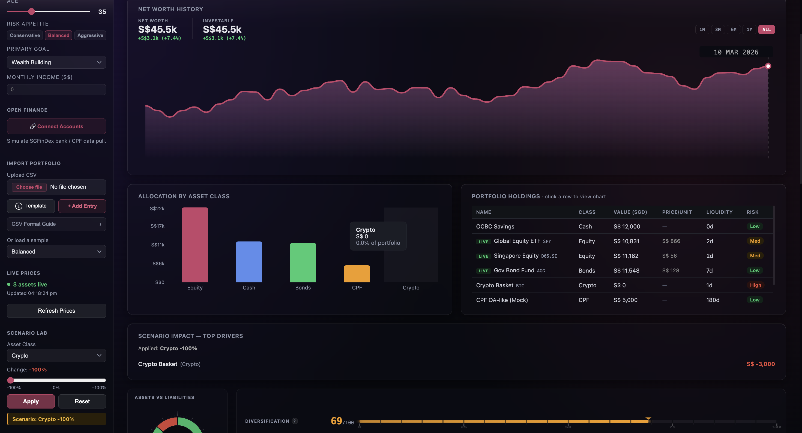
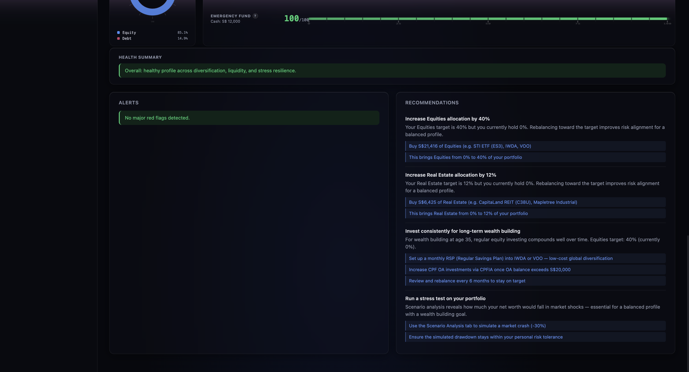

# Wealth Wellness Hub

**Team:** 404  
**Hackathon:** FinTech Innovators Hackathon 2026

Wealth Wellness Hub is a unified financial wellness platform that consolidates fragmented wealth data into a single **Wealth Wallet** and turns it into actionable financial intelligence.

Instead of acting as just another portfolio tracker, the platform helps users understand whether their overall wealth position is actually healthy by analyzing **diversification, liquidity, and resilience** across traditional, private, and digital assets.

> Demo / educational prototype only — not financial advice.

---

## Project Description 

Wealth Wellness Hub is an integrated platform that helps investors and advisers view their full financial position in one place. It unifies fragmented assets across cash, equities, bonds, crypto, private holdings, property, CPF, and liabilities into a single Wealth Wallet dashboard.

Our prototype goes beyond balance tracking by translating portfolio data into financial wellness analytics. It evaluates diversification, liquidity, and resilience under market stress, then generates prioritised recommendations to improve financial health. Users can upload a CSV portfolio, add assets manually, refresh selected live prices, and simulate shocks such as a crypto crash or equity downturn to instantly see how their net worth and scores change.

This solves the problem statement by giving users a secure and intuitive way to understand total wealth composition, identify risks, and take proactive action. Rather than asking only “What do I own?”, Wealth Wellness Hub helps users answer “How financially prepared am I?” — making the platform more useful for long-term planning, advisory conversations, and real-world financial decision-making.

---

## Problem Statement

Investors increasingly manage wealth across fragmented financial ecosystems, including:

- Bank accounts
- Brokerage portfolios
- Cryptocurrency wallets
- Private investments
- Property and alternative assets

Because these assets exist across multiple platforms, users often lack a clear and complete picture of their total financial health. This fragmentation makes it difficult to assess:

- Concentration risk
- Liquidity needs
- Portfolio resilience
- Overall wealth readiness

Wealth Wellness Hub addresses this by providing a single, integrated view of wealth and translating it into actionable financial wellness insights.

---

## Our Solution

Wealth Wellness Hub consolidates a user’s assets into a single **Wealth Wallet** and transforms raw holdings into a clear, intuitive financial wellness dashboard.

The platform allows users to:

- Aggregate traditional, private, and digital assets
- Visualize total wealth composition
- Measure financial wellness using explainable metrics
- Simulate stress scenarios and portfolio shocks
- Receive prioritised recommendations for action

This shifts wealth management from **passive tracking** to **proactive financial decision-making**.

---

## Why Wealth Wellness Hub Is Different

Most platforms focus on tracking balances or performance within one ecosystem only. Wealth Wellness Hub is different because it combines **asset aggregation** with **financial wellness intelligence**.

### 1. Beyond Portfolio Tracking
We do not stop at displaying balances and charts. We assess whether a portfolio is actually healthy by measuring diversification, liquidity, and resilience.

### 2. Full Wealth Visibility
The platform is designed for hybrid portfolios spanning traditional assets, private holdings, and digital assets, giving users a more complete picture of wealth than single-platform tools.

### 3. Scenario-Driven Decision Support
Users can simulate market shocks and immediately see how those events affect net worth, wellness scores, and portfolio risks.

### 4. Actionable, Not Passive
The system generates prioritised recommendations so users know what to do next, instead of simply showing static dashboards.

### 5. Financial Wellness Focus
We shift the conversation from **“What do I own?”** to **“How financially prepared and resilient am I?”**

---

## Key Features (MVP)

### 1) Unified Wealth Wallet
Users can consolidate assets across categories such as:

- Cash
- Equities
- Bonds
- Crypto
- Property
- Private / alternative assets
- CPF
- Liabilities

Portfolio data can be added through CSV upload, manual entry, or sample datasets.

### 2) Financial Wellness Analytics
The platform calculates clear, explainable metrics on a 0–100 scale.

#### Diversification Score
Measures concentration risk across asset classes.

**Example insight:**  
High concentration detected in crypto assets.

#### Liquidity Score
Measures how much of the portfolio can be converted into cash quickly.

**Example insight:**  
Only 18% of portfolio is liquid within 7 days.

#### Resilience Score
Stress-test-based score measuring how the portfolio performs under simulated shocks.

**Example insight:**  
Worst-case drawdown is 21%.

### 3) Scenario Stress Testing
Users can simulate shocks such as:

- Crypto market crash
- Equity downturn
- Interest rate shock

The dashboard recalculates:

- Net worth
- Score changes
- Loss drivers
- Updated recommendations

This helps users understand portfolio resilience before real crises happen.

### 4) Actionable Recommendations
The system generates prioritised next steps based on score outputs.

Examples include:

- Reduce concentration in crypto assets
- Increase liquid reserves for short-term stability
- Rebalance towards more diversified asset classes
- Review debt burden and improve emergency reserves

### 5) Intuitive Interactive Dashboard
The dashboard is designed to make financial health easier to understand through:

- Clear wealth breakdowns
- Visual score indicators
- Alerts and insights
- Scenario comparison views
- Simple portfolio management actions

---

## Example User Journey

1. User uploads a portfolio CSV or loads a sample portfolio  
2. The platform consolidates all holdings into a single Wealth Wallet  
3. The dashboard computes diversification, liquidity, and resilience scores  
4. The user runs a scenario such as a crypto crash or equity selloff  
5. The dashboard updates net worth, risk drivers, and recommendations  
6. The user takes action to improve financial wellness

---

## Target Users

### Primary Users
- Retail investors with assets across multiple platforms
- Young professionals starting to build diversified wealth
- Crypto-active users with fragmented financial holdings
- Mass affluent users seeking a clearer financial overview

### Secondary Users
- Financial advisers
- Relationship managers
- Wealth platforms and fintech providers
- Banks looking to improve digital client engagement

---

## Market Potential

Wealth Wellness Hub addresses a growing need for **holistic financial visibility** in an increasingly fragmented financial landscape.

As more investors hold assets across bank accounts, brokerages, digital wallets, CPF, property, and alternative investments, the demand for unified and actionable wealth monitoring tools will continue to rise.

### Market Opportunity
The platform can serve multiple segments:

- Retail investors seeking better personal financial clarity
- Advisory and wealth management firms improving client engagement
- Digital banks and fintechs embedding financial wellness into their ecosystems
- Institutions building next-generation wealth dashboards

### Commercial Potential
A production version of Wealth Wellness Hub could support:

- B2C subscription plans for advanced analytics
- B2B2C white-label solutions for banks and wealth platforms
- Adviser dashboards for client portfolio reviews
- Premium scenario planning and personalized wealth coaching tools

This gives the solution strong long-term potential in both direct consumer and enterprise markets.

---

## Feasibility, Security, and Scalability

### Hackathon Prototype Feasibility
The current prototype is practical and demo-ready because it:

- Uses structured portfolio inputs
- Processes analytics quickly
- Delivers clear visual outputs
- Avoids dependency on sensitive user credentials for demo use

### Security Model (Demo)
For the hackathon prototype:

- CSV files are processed locally / in memory for demo use
- No persistent storage of sensitive user financial data is required
- No banking credentials are needed
- No personal identity data is necessary to use the demo

### Scalability Path
A production version can scale through:

- Open banking integrations
- Brokerage / wallet API integrations
- Secure user authentication
- Cloud-hosted analytics services
- Adviser-facing dashboards and enterprise deployment

---

## Business Model

A realistic commercialization pathway for Wealth Wellness Hub includes:

### Option 1: Consumer Subscription
Freemium dashboard with paid tiers for:

- Advanced analytics
- Scenario simulation
- Wellness tracking over time
- Personalized financial recommendations

### Option 2: B2B / White-Label SaaS
Banks, fintechs, insurers, and wealth managers could embed the platform into their digital experience as a branded financial wellness layer.

### Option 3: Adviser Enablement
Financial advisers and wealth teams could use the platform as a client-facing advisory dashboard for portfolio review and planning discussions.

---

## System Architecture

```text
User
  ↓
Frontend Dashboard (React)
  ↓
Backend API (Spring Boot)
  ↓
Analytics Engine
  ├── Portfolio Aggregation
  ├── Financial Wellness Scoring
  ├── Scenario Simulation Engine
  └── Recommendation Engine
  ↓
Portfolio Data (CSV / Manual / Sample)
````

---

## Technology Stack

* **Frontend:** React + JavaScript (Vite)
* **Backend:** Spring Boot (Java 17)
* **Data Processing:** Custom portfolio analytics engine
* **Visualization:** Recharts + charting components
* **Market Data:** Selected live price refresh for supported assets
* **Infrastructure (Demo):** Local / demo-safe processing

---

## Data Unification

Wealth Wellness Hub standardizes multiple asset types into a single internal structure so they can be analyzed consistently.

Supported categories include:

* Cash
* Equity
* Bonds
* Crypto
* Property
* Private assets
* CPF
* Liabilities

This enables the platform to evaluate overall wealth health rather than isolated account balances.

---

## Demo Screenshots

### Dashboard Overview


### Financial Wellness Scores


### Scenario Stress Test


### Alerts and Recommendations


---

## Demo Flow (60–90 Seconds)

1. Load a sample portfolio
2. Show the total net worth and wealth breakdown
3. Explain the three financial wellness scores
4. Run a stress scenario such as a crypto crash
5. Show how net worth and scores change
6. Highlight recommendations generated by the platform
7. Switch to another portfolio example to demonstrate a different risk profile

---

## How to Run Locally

### Prerequisites

* Java 17+
* Maven
* Node.js 18+

### Backend

```bash
cd backend
mvn spring-boot:run
```

Backend runs on:

```text
http://localhost:8080
```

### Frontend

```bash
cd frontend
npm install
npm run dev
```

Frontend runs on:

```text
http://localhost:5173
```

## Run with Docker

### Prerequisite
Please install Docker Desktop before running the project.

### Start the app
From the project root, run:

```bash
docker compose up --build
```


Then open:

```text
http://127.0.0.1:3000
```

### Demo flow

1. Load the Balanced sample portfolio

2. Review net worth, assets, debts, cash on hand, and investable assets

3. Explore the asset allocation chart and portfolio holdings

4. Use Scenario Lab to simulate a market shock

5. Observe updated financial wellness scores, alerts, and recommendations

6. Click Refresh Prices to fetch supported live prices

### Stop the app

```
docker compose down
```

---

## Repository Structure

```text
wealth-wellness-hub/
├── backend/                  # Spring Boot backend and analytics services
│   ├── src/
│   ├── .dockerignore
│   ├── Dockerfile
│   └── pom.xml
├── frontend/                 # React frontend dashboard
│   ├── src/
│   ├── .dockerignore
│   ├── Dockerfile
│   ├── nginx.conf
│   ├── package.json
│   └── vite.config.js
├── docs/
│   └── screenshots/          # README and pitch demo screenshots
├── docker-compose.yml        # Full-stack Docker setup
├── .gitignore
├── LICENSE
└── README.md

---

## Future Improvements

Potential next steps include:

* Open banking API integration
* Wallet and brokerage integrations
* Historical trend tracking over time
* AI-assisted financial coaching
* Goal-based planning and forecasting
* Household / family-level financial wellness views
* Adviser collaboration and client reporting features

---

## License

This repository is provided for educational and hackathon demonstration purposes.

MIT License.

````


